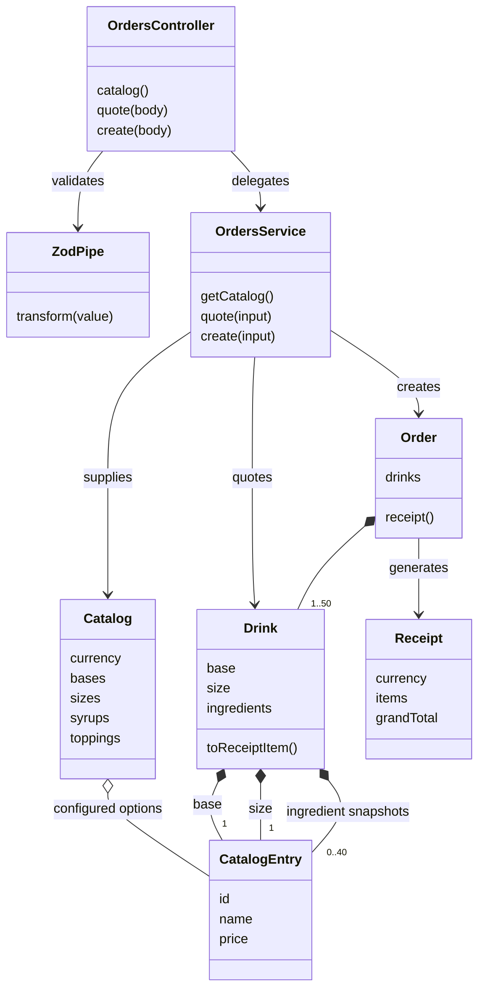

# Customizable Coffee Shop

## Overview

A complete coffee ordering assessment, presented as **Daily Ritual**. Customers compose drinks, keep repeated ingredients, build an order, and receive an itemized receipt calculated by a NestJS backend. The Next.js frontend never calculates ingredient prices itself.

## Features

- Coffee, Tea, and Milk in Small, Medium, and Large sizes.
- Vanilla, Caramel, and Chocolate syrups; Whipped Cream, Cinnamon, and Marshmallows toppings.
- Independent quantity controls, including repeated syrups and toppings.
- Live server quotes, configuration preview, multiple drinks, removal, checkout, and receipt.
- Loading, error, retry, empty-cart, and submission states; cart retained on failed checkout.
- Mobile, tablet, and desktop layouts; semantic fieldsets, labeled quantity buttons, keyboard focus indicators, and live status messages.
- Zod request validation and integer money throughout domain calculations.

## Tech Stack

| Area     | Technologies                                                                                                                              |
| -------- | ----------------------------------------------------------------------------------------------------------------------------------------- |
| Frontend | Next.js 15 App Router, React 19, strict TypeScript, Tailwind CSS 4, shadcn/ui Button and adapted Card source components (Radix Slot, CVA) |
| Backend  | NestJS 11, strict TypeScript, Zod 3                                                                                                       |
| Testing  | Jest + Supertest, Vitest + React Testing Library + user-event, Playwright browser smoke tests                                             |
| Tooling  | pnpm workspace, ESLint (TypeScript, Next.js, React Hooks), Prettier                                                                       |
| Database | None; static server catalog, request-scoped order objects                                                                                 |

Button follows the [shadcn/ui Button composition](https://v3.shadcn.com/docs/components/button), with local theme variants. Card is adapted to a semantic section. These are editable components under `components/ui`, with `components.json` for shadcn tooling; shadcn is an open-code approach, not a runtime component package.

## Architecture

```text
customizable-coffee-shop/
├── apps/
│   ├── api/
│   │   └── src/
│   │       ├── domain/          # Catalog, Drink, Order, business tests
│   │       ├── application/     # OrdersService orchestration
│   │       ├── infrastructure/  # HTTP controller, Zod pipe, API tests
│   │       ├── app.module.ts
│   │       └── main.ts
│   └── web/
│       ├── app/                 # App Router layout/page and theme
│       ├── components/          # Builder, quantity controls, cart, receipt
│       │   └── ui/              # Source-owned shadcn/ui primitives
│       ├── lib/                 # API boundary, money formatting, utilities
│       └── test/                # API contract fixtures
├── packages/shared/src/         # IDs, Zod schemas, transport types (no prices)
├── scripts/ordering.e2e.ts       # Real-stack browser verification
├── playwright.config.ts
├── pnpm-workspace.yaml
└── README.md
```

The HTTP controller validates requests with a Zod pipe and delegates to `OrdersService`. The service coordinates domain objects and the single server catalog. `Drink` and `Order` depend only on shared schemas/types, not NestJS or Next.js. Domain constructors validate inputs as well, so callers outside HTTP cannot bypass invariants.

The browser fetches `/api/catalog`, `/api/quotes`, and `/api/orders`. Next.js rewrites these paths to NestJS. This keeps browser requests same-origin without a CORS configuration. The rewrite does not contain business logic. `API_URL` is server-side configuration, baked into rewrites at build time.

## Design Approach

**Composition over inheritance.** A `Drink` holds a base catalog entry, a size entry, and an array of ingredient entries. Syrups and toppings are distinct typed input arrays, composed into one internal ingredients array in syrup-then-topping order. Every addition is its own entry: two Vanilla IDs produce two entries, two price contributions, and two description fragments. There is no set or deduplication step.

`CatalogEntry` is a small value shape (`id`, `name`, `price`), sufficient for bases, sizes, and ingredients. We do not need artificial `Syrup` or `Topping` subclasses. A drink snapshots entries on construction, preventing later input/catalog mutation from changing it.

`Drink.toReceiptItem()` builds the description and sums base price, size surcharge, and every ingredient. `Order` owns a nonempty array of drinks; `receipt()` emits fresh item data and sums each individual price. This avoids a subclass for every possible combination.

All prices live in `apps/api/src/domain/catalog.ts`. The frontend only formats money, displays API quotes, and sums quoted cart line amounts for an **estimated** total. Checkout sends ingredient IDs only, and the backend recalculates every line and the grand total. Client-supplied price fields are rejected.

Quotes are debounced 150 ms. Abort signals and configuration keys prevent stale responses from being displayed or added to the cart. The add button waits for a quote matching the current configuration. Checkout disables cart and builder changes while pending.

## Architecture / Class Diagram



`Catalog`, `CatalogEntry`, and `Receipt` are TypeScript interfaces; `Drink`, `Order`, `OrdersService`, `OrdersController`, and `ZodPipe` are classes.

## Pricing Assumptions

The assessment did not specify prices. These are illustrative, inclusive THB prices, without separate taxes or fees. **100 satang = THB 1.00**; `15000` means THB 150.00. No floating-point monetary arithmetic is used in the domain.

| Category     | Option        |   THB | Satang |
| ------------ | ------------- | ----: | -----: |
| Base         | Coffee        | 70.00 |   7000 |
| Base         | Tea           | 60.00 |   6000 |
| Base         | Milk          | 50.00 |   5000 |
| Size upgrade | Small         |  0.00 |      0 |
| Size upgrade | Medium        | 15.00 |   1500 |
| Size upgrade | Large         | 30.00 |   3000 |
| Syrup        | Vanilla       | 15.00 |   1500 |
| Syrup        | Caramel       | 15.00 |   1500 |
| Syrup        | Chocolate     | 20.00 |   2000 |
| Topping      | Whipped Cream | 20.00 |   2000 |
| Topping      | Cinnamon      |  5.00 |    500 |
| Topping      | Marshmallows  | 15.00 |   1500 |

Large Coffee + Vanilla + Vanilla + Whipped Cream = `7000 + 3000 + 1500 + 1500 + 2000 = 15000` satang. Medium Tea + Cinnamon = `6000 + 1500 + 500 = 8000`. Together: **23000 satang / THB 230.00**.

Schema limits (20 syrups, 20 toppings, 50 drinks) keep payloads bounded and totals well within JavaScript's safe integer range for this catalog. Every configured price must be a nonnegative safe integer.

## Database Decision

No persistence is required to compose drinks and return receipts, so no database or ORM is installed. Orders exist during request processing; cart and latest receipt exist in browser memory and disappear on refresh. `POST /orders` accepts and prices an order but does not durably save it or dispatch it to a real barista.

To add persistence, introduce a small order repository boundary in the application layer and a PostgreSQL + Drizzle ORM implementation under infrastructure. Save order and line-item snapshots transactionally, including the ordered ingredient occurrences (with positions or quantities), receipt descriptions, currency, and prices at purchase time. `OrdersService` would persist the domain result after calculation. The `Drink` and `Order` classes would remain unchanged and independent of Drizzle. An admin-managed catalog can map database records into the existing `Catalog` interface.

## API Documentation

Backend default: `http://127.0.0.1:3001`. Browser proxy prefix: `/api` on port 3000. All request and response bodies are JSON.

### GET /catalog — 200 OK

Returns `currency`, `bases`, `sizes`, `syrups`, and `toppings`. Each entry includes `id`, `name`, and integer `price`. Size prices are additive upgrades. Example entry: `{"id":"vanilla","name":"Vanilla","price":1500}`. The full list is the pricing table above, sourced from the server catalog.

### POST /quotes — 200 OK

Prices a single configuration without creating an order.

```json
{
  "base": "coffee",
  "size": "large",
  "syrups": ["vanilla", "vanilla"],
  "toppings": ["whipped_cream"]
}
```

Response:

```json
{
  "description": "Large Coffee, Vanilla, Vanilla, Whipped Cream",
  "price": 15000
}
```

### POST /orders — 201 Created

```sh
curl -s http://127.0.0.1:3001/orders \
  -H 'Content-Type: application/json' \
  -d '{"drinks":[{"base":"coffee","size":"large","syrups":["vanilla","vanilla"],"toppings":["whipped_cream"]},{"base":"tea","size":"medium","syrups":[],"toppings":["cinnamon"]}]}'
```

Response:

```json
{
  "currency": "THB",
  "items": [
    {
      "description": "Large Coffee, Vanilla, Vanilla, Whipped Cream",
      "price": 15000
    },
    { "description": "Medium Tea, Cinnamon", "price": 8000 }
  ],
  "grandTotal": 23000
}
```

### Validation and errors

All four drink fields are required; empty ingredient arrays are valid. Exactly one valid base and size are required. Unknown IDs, unexpected fields, non-array ingredients, more than 20 syrups/toppings, and orders outside 1–50 drinks return **400 Bad Request**. Duplicates are valid and preserved. Structured errors include paths:

```json
{
  "message": "Invalid request",
  "errors": [
    {
      "path": "drinks.0.base",
      "message": "Invalid enum value. Expected 'coffee' | 'tea' | 'milk', received 'juice'"
    }
  ]
}
```

Malformed JSON is rejected by the HTTP adapter with 400. Unexpected server failures return 500; frontend errors provide an understandable retry message without dropping the cart.

## Running Locally

Prerequisites: Node.js 20.12+ (Node 22 LTS recommended), pnpm 10.8.1. The lockfile pins the dependency graph; Vite 6 is explicit to support the lower Node 20 runtime.

```sh
cd customizable-coffee-shop
pnpm install
pnpm dev
```

- Frontend: **http://localhost:3000**
- Backend: **http://127.0.0.1:3001**

No credentials, database, or environment file are needed. Backend `PORT` defaults to 3001. To change the upstream, set `API_URL` in `apps/web/.env.local` using `.env.example`, then restart dev or rebuild. The API binds to loopback for local use; adjust deployment binding if containerizing.

Production:

```sh
pnpm build
pnpm --parallel --filter @coffee/api --filter @coffee/web start
```

## Testing

```sh
pnpm typecheck
pnpm lint
pnpm format:check
pnpm test
pnpm test:coverage
pnpm build
```

Independent suites (build shared contracts once after a clean clone):

```sh
pnpm --filter @coffee/shared build
pnpm --filter @coffee/api test
pnpm --filter @coffee/web test
pnpm --filter @coffee/api test:coverage
pnpm --filter @coffee/web test:coverage
```

Jest covers base/size/syrup/topping pricing, mixed and duplicate ingredients, description generation, immutable snapshots, single/multiple drink totals, invalid inputs, and real NestJS HTTP validation/status behavior. Supertest uses an ephemeral loopback port. Vitest tests user-visible customization, duplicate quantities, removal, multi-drink carts, server quote display, receipt lines/totals, pending requests, validation/network failures, retries, quote cancellation, and customization limits. API mocks are at the frontend transport boundary; frontend tests do not implement a pricing engine.

Both suites emit console, LCOV, and HTML coverage. Open `apps/api/coverage/index.html` and `apps/web/coverage/index.html`. Backend coverage excludes bootstrap/module wiring, and frontend coverage excludes source-owned UI primitives and class-name helpers. Coverage is not inflated with snapshot-only tests or enforced at 100%.

Real-stack browser checks use installed Google Chrome:

```sh
pnpm build
pnpm test:e2e
```

Playwright starts both production servers automatically and checks duplicate Vanilla, two different drinks and their receipt, network failure/retry, and layouts at 375×812, 768×1024, and 1440×1000. Screenshots go to `test-results/`. If Chrome is absent, install it or change `channel: 'chrome'` in `playwright.config.ts` to a Playwright-managed Chromium setup. Unit/component tests do not require a browser installation.

### Verified assessment results

Verified on 2026-10-01 with Node 20.12.2 and pnpm 10.8.1:

| Check                         | Result                                                                       |
| ----------------------------- | ---------------------------------------------------------------------------- |
| Install                       | Completed; lockfile included                                                 |
| Typecheck                     | Passed across all workspace packages                                         |
| ESLint / Prettier             | Passed with no lint warnings                                                 |
| Jest                          | 44 tests passed                                                              |
| Vitest                        | 28 tests passed                                                              |
| Playwright / installed Chrome | 5 tests passed                                                               |
| Total                         | 77 tests passed (72 unit/component/integration + 5 browser)                  |
| Backend coverage              | 100% statements, branches, functions, and lines in configured scope          |
| Frontend coverage             | 99.26% statements/lines, 95.72% branches, 100% functions in configured scope |
| Production build              | Next.js frontend and NestJS backend passed                                   |

Browser verification used the real NestJS server and confirmed the exact duplicate-Vanilla description and THB 150.00 price, Medium Tea with Cinnamon at THB 80.00, and a THB 230.00 grand total. Failed checkout preserved the cart and succeeded on retry. Mobile, tablet, and desktop screenshots were visually inspected; browser assertions checked horizontal overflow and completed ordering at each size. These were automated browser interactions plus screenshot review, not a human-operated device test. Safari and Firefox were not tested.

## Adding a New Ingredient

For Hazelnut Syrup:

1. Add `"hazelnut"` to `syrupIds` in `packages/shared/src/index.ts`. The Zod enum and TypeScript union are inferred automatically.
2. Add `{ id: "hazelnut", name: "Hazelnut", price: 1500 }` to `catalog.syrups` in `apps/api/src/domain/catalog.ts`.
3. Add a meaningful pricing/validation test, update the documented prices, and rebuild.

The catalog-driven frontend automatically renders its quantity control. `Drink` already composes and prices each occurrence. No `HazelnutCoffee`, `LargeHazelnutCoffee`, controller change, or UI pricing rule is needed. Contract fixtures can be extended when testing the new UI option specifically.

## Trade-offs

- A static typed catalog keeps the assessment easy to review. New IDs require a shared-contract rebuild rather than an admin panel.
- Live server quotes add a small request/latency cost but keep pricing authoritative and avoid duplicating business logic. There is no offline pricing fallback.
- Simple local React state is enough; no global state library or cart persistence.
- Client checkout guards stop concurrent clicks within this UI; durable idempotency would be needed alongside persistence/payment processing.
- Successful checkout returns a receipt, not a tracked fulfillment workflow. No payment, authentication, or historical order lookup is implied.
- Ingredient limits are documented defensive assumptions, not deduplication rules.
- No application repository abstraction exists until persistence gives it a purpose.

## Future Improvements

PostgreSQL + Drizzle persistence, order history, authentication, an admin-managed catalog, inventory constraints, durable idempotency, fulfillment tracking, and payment integration are sensible next steps. They are deliberately outside this assessment's scope.
