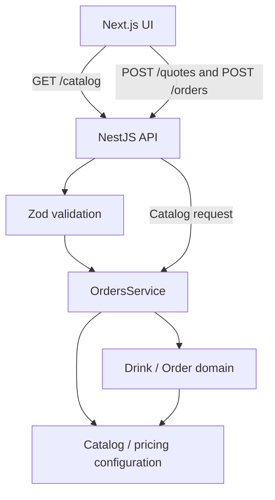

# Customizable Coffee Shop

## Overview

**Daily Ritual** is a customizable coffee ordering application. Customers build drinks, add them to an order, and receive an itemized receipt. Next.js handles the interface; NestJS calculates every quote and final order price.

## Features

- Coffee, Tea, or Milk in Small, Medium, or Large.
- Vanilla, Caramel, and Chocolate syrups.
- Whipped Cream, Cinnamon, and Marshmallows toppings.
- Quantity controls that support repeated ingredients, including Vanilla ×2.
- Server-calculated previews, multiple drinks, removal, checkout, and receipts.
- Responsive layout with loading, error, and retry feedback.

## Tech Stack

- **Frontend:** Next.js App Router, React, TypeScript, TanStack Query, Tailwind CSS, shadcn/ui components.
- **Backend:** NestJS, TypeScript, Zod.
- **Testing:** Jest + Supertest, Vitest + React Testing Library, Playwright.
- **Tooling:** pnpm workspace, strict TypeScript, ESLint, Prettier.

## Architecture



| Location                      | Responsibility                                               |
| ----------------------------- | ------------------------------------------------------------ |
| `apps/web`                    | Drink builder, order state, API calls, and receipt display   |
| `apps/api/src/infrastructure` | Thin HTTP controller and Zod validation pipe                 |
| `apps/api/src/application`    | Service coordinating catalog, quotes, and orders             |
| `apps/api/src/domain`         | Drink composition, descriptions, pricing, and receipts       |
| `packages/shared`             | Request schemas and API types shared by frontend and backend |

The domain does not depend on Next.js or NestJS. Shared contracts keep API inputs consistent without putting pricing logic in the frontend. Next.js forwards `/api/*` requests to NestJS.

## Design Approach

TanStack Query manages server state and asynchronous request lifecycle, while React state manages local UI state such as drink configuration and cart contents. Catalog and quote requests use queries; checkout uses a mutation. Native fetch remains the HTTP transport. Failures use explicit retry buttons rather than automatic retries.

Composition keeps the model small:

```text
Order → Drink[]
Drink = Base + Size + Ingredients[]
```

A drink contains one base, one size, and ingredient entries. Each occurrence contributes to the description and price, so two Vanilla entries are naturally charged twice. No subclasses are needed for individual combinations.

`Drink.toReceiptItem()` returns a description and price. `Order.receipt()` collects these items and sums their prices. The frontend requests a quote when a drink changes and displays the returned price. At checkout, it sends only drink configurations; the backend calculates everything again and returns the authoritative receipt.

Zod validates required fields, allowed options, ingredient arrays, and a nonempty order. Duplicate ingredients remain valid. There are no application-defined quantity caps.

## Pricing

The assessment does not specify prices, so these are sample assumptions. All pricing is centralized in `apps/api/src/domain/catalog.ts`. Money uses integer **satang**: `7000 = THB 70.00`. Size prices are added to the base price.

| Category              | Options and prices (THB)                      |
| --------------------- | --------------------------------------------- |
| Base                  | Coffee 70; Tea 60; Milk 50                    |
| Size adjustment       | Small 0; Medium 15; Large 30                  |
| Syrup, per addition   | Vanilla 15; Caramel 15; Chocolate 20          |
| Topping, per addition | Whipped Cream 20; Cinnamon 5; Marshmallows 15 |

Large Coffee + Vanilla + Vanilla + Whipped Cream costs `7000 + 3000 + 1500 + 1500 + 2000 = 15000` satang. Adding Medium Tea + Cinnamon at `8000` gives an order total of `23000` satang (**THB 230.00**).

## API

Backend: `http://127.0.0.1:3001`. Browser requests use `/api` through Next.js.

| Endpoint       | Purpose                                                     | Success status |
| -------------- | ----------------------------------------------------------- | -------------- |
| `GET /catalog` | Available bases, sizes, syrups, toppings, names, and prices | 200            |
| `POST /quotes` | Price and describe a single drink                           | 200            |
| `POST /orders` | Recalculate all drinks and return an itemized receipt       | 201            |

Catalog entries use `{ "id": "vanilla", "name": "Vanilla", "price": 1500 }`. The catalog includes `currency: "THB"` and arrays named `bases`, `sizes`, `syrups`, and `toppings`.

Quote request:

```json
{
  "base": "coffee",
  "size": "large",
  "syrups": ["vanilla", "vanilla"],
  "toppings": ["whipped_cream"]
}
```

Quote response:

```json
{
  "description": "Large Coffee, Vanilla, Vanilla, Whipped Cream",
  "price": 15000
}
```

Order request:

```json
{
  "drinks": [
    {
      "base": "coffee",
      "size": "large",
      "syrups": ["vanilla", "vanilla"],
      "toppings": ["whipped_cream"]
    },
    {
      "base": "tea",
      "size": "medium",
      "syrups": [],
      "toppings": ["cinnamon"]
    }
  ]
}
```

Order response:

```json
{
  "currency": "THB",
  "items": [
    {
      "description": "Large Coffee, Vanilla, Vanilla, Whipped Cream",
      "price": 15000
    },
    { "description": "Medium Tea, Cinnamon", "price": 8000 }
  ],
  "grandTotal": 23000
}
```

Invalid selections, missing fields, non-array ingredients, unexpected fields (including client prices), and empty orders return **400 Bad Request**. Validation responses contain `message: "Invalid request"` and an `errors` array with field paths and messages.

## Running Locally

Requires Node.js 20.12+ and pnpm 10.8.1.

```sh
git clone https://github.com/TanThivakorn/coffee-shop.git
cd coffee-shop
pnpm install
pnpm dev
```

- Frontend: http://localhost:3000
- Backend: http://127.0.0.1:3001

No database or environment file is required. To change the backend URL, set `API_URL` in `apps/web/.env.local` using `.env.example`; restart development or rebuild. The backend port can be set with `PORT`.

For a production build:

```sh
pnpm build
pnpm --parallel --filter @coffee/api --filter @coffee/web start
```

## Testing

```sh
pnpm typecheck
pnpm lint
pnpm test
pnpm test:coverage
pnpm build
```

Run individual suites after building the shared package:

```sh
pnpm --filter @coffee/shared build
pnpm --filter @coffee/api test
pnpm --filter @coffee/web test
```

Backend tests cover pricing, duplicates, descriptions, order totals, and API validation. Frontend tests cover selections, quantities, cart actions, server quotes, checkout, receipts, and loading/error feedback. Frontend tests mock the API boundary rather than reproduce the pricing engine.

Coverage reports are generated in `apps/api/coverage` and `apps/web/coverage`. Open each `index.html` for details. Bootstrap wiring and UI primitives are excluded from coverage.

The existing Playwright checks exercise the real application, including checkout and responsive layouts. They require Google Chrome:

```sh
pnpm build
pnpm test:e2e
```

Use `pnpm format:check` to check formatting or `pnpm format` to apply it.

## Adding a New Ingredient

To add Hazelnut Syrup:

1. Add `"hazelnut"` to `syrupIds` in `packages/shared/src/index.ts`.
2. Add `{ id: "hazelnut", name: "Hazelnut", price: 1500 }` to `catalog.syrups` in `apps/api/src/domain/catalog.ts`.
3. Add a pricing test and update the documented prices.

Validation and types follow the shared ID list. The frontend renders options from the catalog, and the domain prices every ingredient entry. No new drink class is needed.

## Database Decision

A database is intentionally omitted because the current requirements do not require persistence. The catalog is held in memory; orders are calculated per request. The cart and receipt disappear on refresh.

If persistence is needed later, PostgreSQL + Drizzle ORM can be added behind the application layer without changing the core drink and order logic.

## Trade-offs

- A static catalog is easy to review and extend, but changing available ingredients requires a code change.
- Server quotes require a network request on each configuration change, keeping pricing in one place.
- React state keeps the cart and drink configuration local; TanStack Query handles server requests.
- Orders return receipts without durable storage, payments, or fulfillment tracking.
